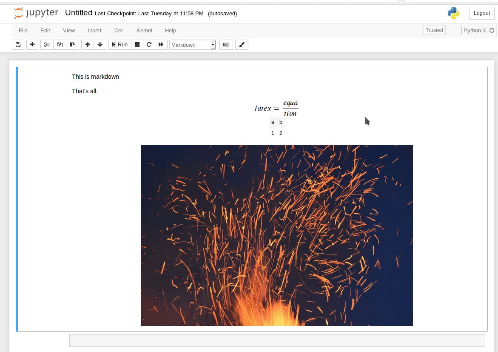

Pizarra-nb
==========

This is a Jupyter notebook extension that creates a canvas of a cell and allows
to paint onto the contents so it could be used to explain some concepts in an
interactive way without the need to use a blackboard.

See an example below:

THIS IS TESTED ONLY IN FIREFOX WITH THE LATEST VERSION OF NOTEBOOK. USE IT
AT YOUR OWN RISK.

What is 'pizarra'?
------------------

Pizarra is the spanish word for blackboard, whiteboard, greenboard.

Motivation
----------

I have to give workshops, lessons, classes,..., in some of them there isn't
a blackboard available to explain some concepts so, why not something available
from the notebook itself?

Features
--------

You can use:

* a pen to draw over the cell, you can select the size, color and transparency.
* you can undo an action.
* you can redo an action.
* you can save the result of the cell and your drawings as a png file in your disk drive.
* you can save the result of the cell and your drawings as an image included in a new cell below the used cell.

How it works?
-------------

After clicking the toolbar button (see video above) the selected cell is
transformed to a HTML5 canvas using html2canvas (see next section). This 
canvas is included in a HTML div element and some functionality is added 
with the help of a modified version of sketchpad (see next section). The 
final result is shown in a dialog where you can interact with the converted
cell.

I've tested images, latex formulas, code cells, markdown cells,... If it is
in the notebook it seems is working. If you use, for instance, an image 
from other server it will not work.

Potential improvements
----------------------

Open an issue indicating a functionality that could be useful for your usecase.
Some ideas:

* The possibility to write text.
* The possibility to use arrows (single arrow and double arrow).
* The possibility to draw squares/rectangles.
* The possibility to draw ciorcles/ellipses.
* ...

Third party libs used
---------------------

* [html2canvas](http://html2canvas.hertzen.com/)
* A modified version of [Sketchpad](http://yiom.github.io/sketchpad/)

References used
---------------

* [https://www.stefaanlippens.net/jupyter-notebook-dialog.html](https://www.stefaanlippens.net/jupyter-notebook-dialog.html)

* [https://reference.codeproject.com/book/dom/canvas_api/drawing_dom_objects_into_a_canvas](https://reference.codeproject.com/book/dom/canvas_api/drawing_dom_objects_into_a_canvas)

* [https://jsfiddle.net/codepo8/V6ufG/2/](https://jsfiddle.net/codepo8/V6ufG/2/)
